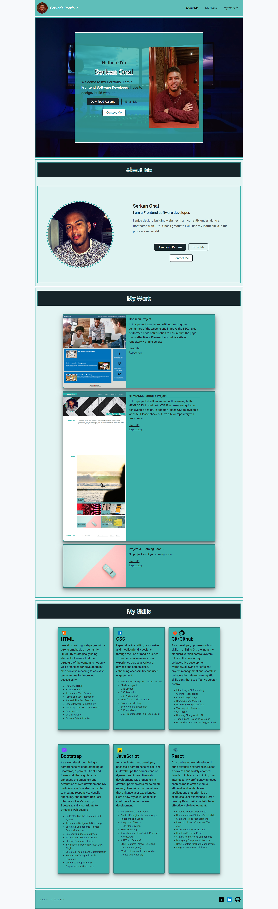

# Serkan Onal Bootstrap Portfolio

## Description

This Bootstrap portfolio project was created in order to provide people/ employers the ability to find out more information about myself and the work/ projects i have either created or collaborated on.

I have attempted to show case my ability using Bootstrap to complete this portfolio project and refrained from relying on CSS to build this project.

I have attempted to demonstrated my abilities in Bootstrap by creating this website which has clear/ concise layout, provides friendly user experience with navigatable links to specific sections of the website.

The website presents my projects and allows users the ability to view the source code/ repositories and active/ live site when the links are click on.

The website also encorporates a responsive design to allow users the ability to view it on different device screens. This was achieved using Bootstrap and using the bootstrap grids, container, flexboxes and break points to achieve this.

 Some considerations which i had to encoporate into my website beforehand and during the development. 

- ***Clean and consistant layout*** - To provide a clean website layout, which enables users to navigate the website and find relevant information.
- ***Navigation*** - Provide clear links to sections of the website with the use of a navigation bar.
- ***Present Projects/ Work*** - Provide a section of the website which will allow people the ability to view work which i have created or collaborated on. All bodies of work will allow users to view active/ live sites or repositories when click on.
- ***Responsive Design*** - Provide a website which is responsive, and can adjust/ adapt itself to different screen size.
- ***Interactive Design*** - Provide users with some interactive elements so they are able to have better user experience.
- ***Code Optimisation*** - Reduce the amount of repeated code within the website to make the website load faster and easier to understand for other developers. 
-***Relying on Bootstrap*** - Relying on boostrap framework/ library to achieve all of the points above and refrain from using CSS to achieve layout and design.
 

- **What was the motivation for this project**
    
  I wanted to provide people/ employers the ability to view a website which contains information about myself and all work/ projects i have created and worked on.

  I wanted to show case my ability in using bootstrap to create a portfolio and not use CSS for layout, only using css for styling certain elements.
  
   
- **Why was this project built**
  &nbsp;&nbsp;&nbsp;&nbsp;&nbsp;&nbsp;
  1. To allow people/ employers the ability to find out more information about myself.
   
  1. To demonstrate all work/ projects i have either created or collaborated on.
   
  1. To demonstrate my ability to create a website/ portfolio using bootstrap.
 

- **The problems that where solved in this project**
 
 1. Provide users the ability to view a website which contains information about myself and my bodies of work. Which was overcome by using the bootstrap framework/ libraries. Using Bootstrap Grids, flexboxes, containers, classes and examples i was able to customise and style certain elements within my portfolio  
 2. Attempts to provide a pleasant user experience, by provide a consistent layout throughout the website. Which was created by using Bootstrap Classes.
 3. Provides clear navigatable links to relevant sections when click on, with the use of anchor tags.
 4. Provide users with interactive elements to improve upon layout and create a more enoyable experience. Elements with either change colour or provide some animation that will enable the user to know what they are selecting a section.

- What did you learn? 
  1. Within this project i learnt/ gained some experience using Bootstrap framework/libraries, encorporating Bootstrap Grids/ Flexboxes, containers classes and components.
    
  1. Learnt to use Bootstrap, Bootstrap Grids, Flexboxes, component and classes to create more complex layouts.
    
  1. The use of Bootstrap classes to adjust layout, design, spacing and position, and how to use them to adjust the size and spacing of the layout or elements on the website.
    
  1. Used Bootstrap break points to make the website adaptable to different screen sizes and how to adjust specific sections of a website to provide a better viewing and user experience. 
## Table of Contents

- [Serkan Onal Bootstrap Portfolio](#serkan-onal-bootstrap-portfolio)
  - [Description](#description)
  - [Table of Contents](#table-of-contents)
  - [Installation](#installation)
  - [Live Site](#live-site)
  - [Serkan Onal Bootstrap Portfolio and Source code on Github](#serkan-onal-bootstrap-portfolio-and-source-code-on-github)
  - [Usage](#usage)
  - [Credits](#credits)
  - [License](#license)

## Installation

**Using Git to create a copy/ clone of website.**

1. Open either Git Bash (Windows) or Terminal (MacOS) and the following commands to create a copy of the website.
   
2. Create a folder/ directory to store website folders/ files within it use the following command 
  &nbsp;&nbsp;&nbsp;&nbsp;&nbsp;&nbsp; -
 ` mkdir "folder name"` 

1.  Navgate into folder using following command. 
  &nbsp;&nbsp;&nbsp;&nbsp;&nbsp;&nbsp; -
  `cd "folder name"` 

1. To make a copy/ clone of the website inside of the folder/ directory use the following command 
  &nbsp;&nbsp;&nbsp;&nbsp;&nbsp;&nbsp; -
  `git clonegit@github.com:serk03/Bootstrap-Portfolio.git`
  
1. Navigate inside of your folder/ directory that you copied using the following commands. 
&nbsp;&nbsp;&nbsp;&nbsp;&nbsp;&nbsp; -
  `cd "folder/ directory name"`

1. To view the folder/ files from the website inside a VS Code using the following command. 
&nbsp;&nbsp;&nbsp;&nbsp;&nbsp;&nbsp; -
  `code .`

1. Open the files you would like to view using the following command. 
&nbsp;&nbsp;&nbsp;&nbsp;&nbsp;&nbsp; 
  -index.html - right and select open with default browser, will open the website in your default browser.
   
&nbsp;&nbsp;&nbsp;&nbsp;&nbsp;&nbsp; 
 -Double click on either index.html/ styles.css to view code that has been used to create website structure (index.html) and styling (style.css).

 

## Live Site
- To view the live/ active website please click on the following link: [View Live Serkan Onal Bootstrap Portfolio](https://serk03.github.io/Bootstrap-Portfolio/)

## Serkan Onal Bootstrap Portfolio and Source code on Github
- To view the repository and its source code please visit Github by clicking on the following link: [View Github Repository](https://github.com/serk03/Bootstrap-Portfolio)

## Usage

Provide instructions and examples for use. Include screenshots as needed.

**Navigation Bar**
- Use the navigation links at top to immediately navigate to corresponding section below.
 
&nbsp;&nbsp;&nbsp;&nbsp;&nbsp;&nbsp; 
-About Me - By clicking on this navigation it link will take you to the about me section of the portfolio. 
 
&nbsp;&nbsp;&nbsp;&nbsp;&nbsp;&nbsp; 
-My Skills - By clicking on this navigation link it will take you to section about my skills, which i have learnt and am developing towards. 
 
&nbsp;&nbsp;&nbsp;&nbsp;&nbsp;&nbsp; 
-My Work - By clicking on this navigation link will present you with a dropdown of different projects, by clicking on these links it will take you to assiociated project.These will have links to take you to the live and repositories of the projects.
 
&nbsp;&nbsp;&nbsp;&nbsp;&nbsp;&nbsp; 
-Contact Me - By clicking on this navigation link it will take you to the Contact Me section of the website. In this section there clickable icons which will take you to my profile pages on either: Twitter, Linkedin or Github.
 

**Scroll Function**
&nbsp;&nbsp;&nbsp;&nbsp;&nbsp;&nbsp; 
- You can use the scroll functionality on your mouse to either move up or down on the website.
&nbsp;&nbsp;&nbsp;&nbsp;&nbsp;&nbsp;

  **Contact Me Section**
  &nbsp;&nbsp;&nbsp;&nbsp;&nbsp;&nbsp; 
  - Linkedin Link(Icon) - will take you to Serkan Onal Linkedin Profile Page.
  - Github Link(Icon) - will take user to Serkan Onal Github profile page.
  - Twitter Link(Icon) - will take user to Serkan Onal Twitter profile page. 
  

## Credits

No collaborators where used when refactoring this website.

Sole authour

## License

No Licenses where used or applied to this website.

